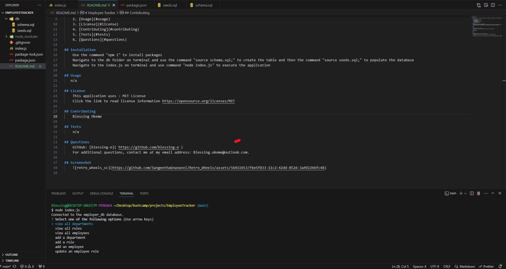

# Employee Tracker
    
## Description
Employee tracker is an application that simply tracks employees in an orgainzation. MySQL database and javascript is used to accomplish the following tasks:
WHEN I start the application
THEN I am presented with the following options: view all departments, view all roles, view all employees, add a department, add a role, add an employee, and update an employee role
WHEN I choose to view all departments
THEN I am presented with a formatted table showing department names and department ids
WHEN I choose to view all roles
THEN I am presented with the job title, role id, the department that role belongs to, and the salary for that role
WHEN I choose to view all employees
THEN I am presented with a formatted table showing employee data, including employee ids, first names, last names, job titles, departments, salaries, and managers that the employees report to
WHEN I choose to add a department
THEN I am prompted to enter the name of the department and that department is added to the database
WHEN I choose to add a role
THEN I am prompted to enter the name, salary, and department for the role and that role is added to the database
WHEN I choose to add an employee
THEN I am prompted to enter the employee’s first name, last name, role, and manager, and that employee is added to the database
WHEN I choose to update an employee role
THEN I am prompted to select an employee to update and their new role and this information is updated in the database 
    
## Table of Contents
1. [Installation](#installation)
2. [Usage](#usage)
3. [License](#license)
4. [Contributing](#contributing)
5. [Tests](#tests)
6. [Questions](#questions)
    
## Installation
Use the command "npm i" to install packages
Navigate to the db folder on terminal and use the command "source schema.sql;" to create the table and then the command "source seeds.sql;" to populate the database
Navigate to the index.js on terminal and use command "node index.js" to execute the application
    
## Usage
n/a
    
## License
This application uses : MIT License
Click the link to read license information https://opensource.org/licenses/MIT
    
## Contributing
 Blessing Okeme
    
## Tests
    n/a
    
## Questions
GitHub: [blessing-o]( https://github.com/blessing-o )
For additional questions, contact me at my email address: Blessing.okeme@outlook.com.

## Screenshot
